# DIU26
Prácticas Diseño Interfaces de Usuario (Tema: .... ) 

* [Guiones de prácticas](GuionesPracticas/)
* [Guía para crea tu Case Study](Guia_CaseStudy.md)
* Sala de la Fama [DIU Hall of fame](https://github.com/mgea/DIU/tree/master/hall_of_fame) donde se pueden encontrar Case Study destacados de otros años.

Actualizado: 14/01/2026

## Paso 0 My UX-Case Study
 
-----

Grupo: DIU1.Pogo  Curso: 2025/26 

Nombre del Proyecto: 

>>> Decida el nombre corto de su propuesta en la práctica 2 

Descripción: 

Nuestra idea de proyecto es un restaurante temático de Pokémon donde los clientes puedan crear sus propios platos estilo poke formando su “equipo de 6” con ingredientes que representen distintos Pokémon. También ofreceremos platos inspirados en entrenadores famosos como Misty o Brock, y menús especiales de 4 platos basados en líderes y campeones de las ligas de distintas regiones como Johto, Kalos o Teselia.

Los pedidos se realizarán en una máquina que simula ser un PC Pokémon, similar a un puesto de pedido automático, desde donde los clientes podrán elegir sus platos antes de recibir el servicio en mesa. Además, el restaurante contará con un sistema de fidelización en forma de tarjeta de medallas, donde a los clientes que repitan se les sellará una medalla en cada visita y, al conseguir las 8 medallas, obtendrán un entrante gratis.

La página web

Logotipo: 
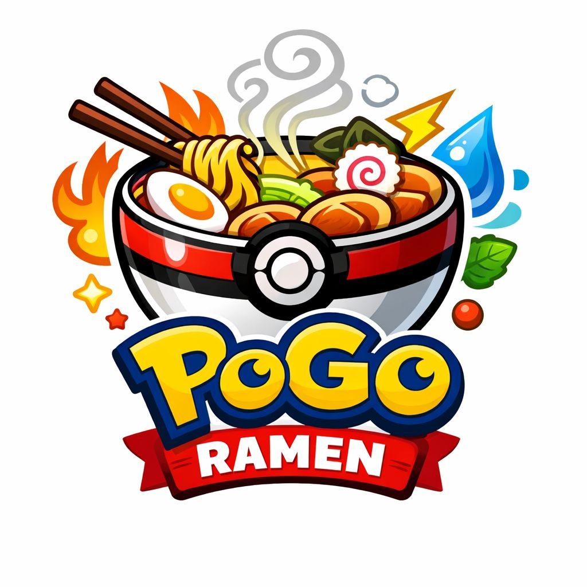

Miembros y nombre del equipo:
 * DIU1.Pogo
 * :bust_in_silhouette:  Alberto David Gómez Gijón: https://github.com/Mercenari23     :octocat:     
 * :bust_in_silhouette:  Manuel José Fernández Poyatos: https://github.com/ManuehFernandez     :octocat:

----- 

 

# Proceso de Diseño 

 

## Paso 1. UX User & Desk Research & Analisis 

### 1.a User Reseach Plan
 
-----
Hemos elegido para la investigación el restaurante Hanazono L'Eliana, ubicado en Valencia, que se caracteriza por su ambientación inspirada en la comida japonesa y el mundo del anime, lo cual hace que conecte fuertemente con el público joven. Esto es debido a cómo está ambientado por dentro, ya que cuenta con elementos visuales, decorativos y conceptuales que hace que disfrutes de una experiencia inmersiva.

Hemos realizado la investigación porque uno de nuestros principales objetivos es que el cliente conecte con el restaurante y con nosotros de una forma que no hayan experimentado todavía. Es por ello que hemos elegido el restaurante Hanazono L'Eliana. También se pretende mejorar la diversidad a la hora de los platos de comida, ya que por nuestra idea, debemos tener una amplia variedad de comida.

Por último, tener un buen engagement en redes sociales, al igual que Hanazono L'Eliana, con la ayuda de la estética y presentación de los platos para así motivar a los usuarios compartir contenido del restaurante.

Para llevar a cabo la investigación, se empleará una combinación de entrevistas y encuestas con el objetivo de obtener una visión completa tanto del interés de los usuarios como de su percepción de nuestro concepto.

En primer lugar, se realizarán encuestas online dirigidas a personas entre 18 y 35 años interesadas en Pokémon o en restaurantes temáticos(sobre todo con el anime). Estas encuestas permitirán saber sobre el nivel de interés en el concepto, las preferencias de los usuarios y su percepción inicial del restaurante.

En segundo lugar, se llevarán a cabo entrevistas semiestructuradas, es decir, una mezcla de preguntas ya definidas y temas de conversación no definidos antes de la conversación, con el objetivo de profundizar en las opiniones, motivaciones y expectativas de los usuarios. Esto permitirá entender mejor qué elementos del mundo Pokémon resultan más atractivos y cómo interpretan la propuesta del restaurante.
>>> 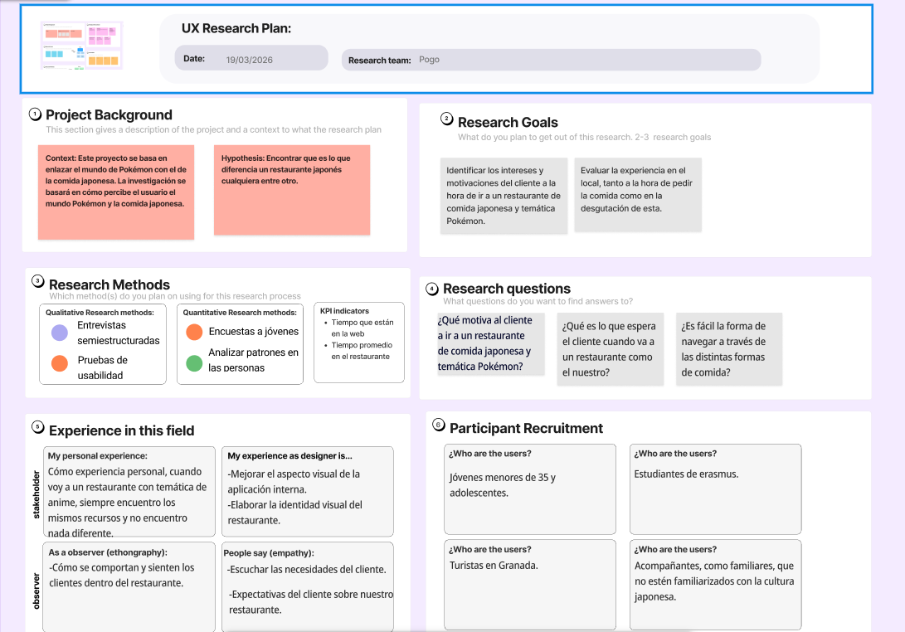

### 1.b Competitive Analysis
 
-----

Para el análisis competitivo hemos elegido dos restuarantes enlazados con el ramen, Ramen Shifu y Otaku Ramen.

Ramen Shifu: Es una cadena de restaurantes con varios locales en España. Su modelo se basa tener una experiencia temática ligera que atrae un gran público. Ofrece una carta que se centra en ramen pero con acompañamientos japoneses como pueden ser gyozas por ejemplo. La carta es clara y reconocible, algo a tener en cuenta, y la tematización no interfiere en esta.
La experiencia es ágil y eficiente, lo cual hace que el usuario entre y consuma sin problemas. La forma de conectar con el público es a través de la estética visual y de redes sociales.

Ramen Otaku: Es un restaurante que está más enfocado al público que le gusta el anime y el manga. Por ello la tematización es más intensa que por ejemplo, el Ramen Shifu, haciendo más incapié en la caracterización de los platos y ambientación. Una diferencia principal respecto al anterior es en el menú, teniendo este más peso en el concepto sobre la claridad.
La experiencia del usuario es más inmersiva que la anterior, y este se ve atraído por el contenido visual que atractivo que se hace en redes sociales.
>>> 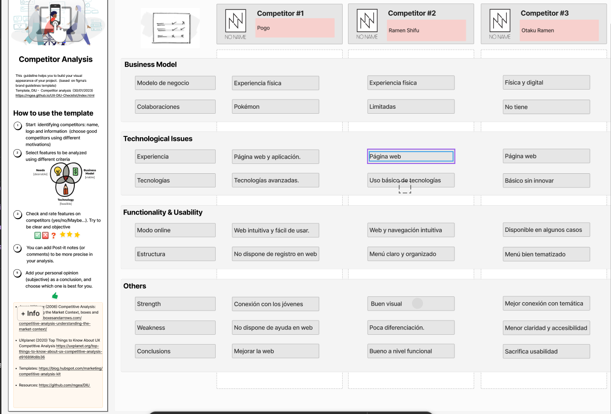
### 1.c Personas
 
-----
  
Para el desarrollo de este proyecto hemos creado a dos personas ficticias,Alex y Miguel, para intentar ponernos en su lugar, dejando de lado nuestras inquietudes y empatizar con las necesidades de usuarios variados.

>>> 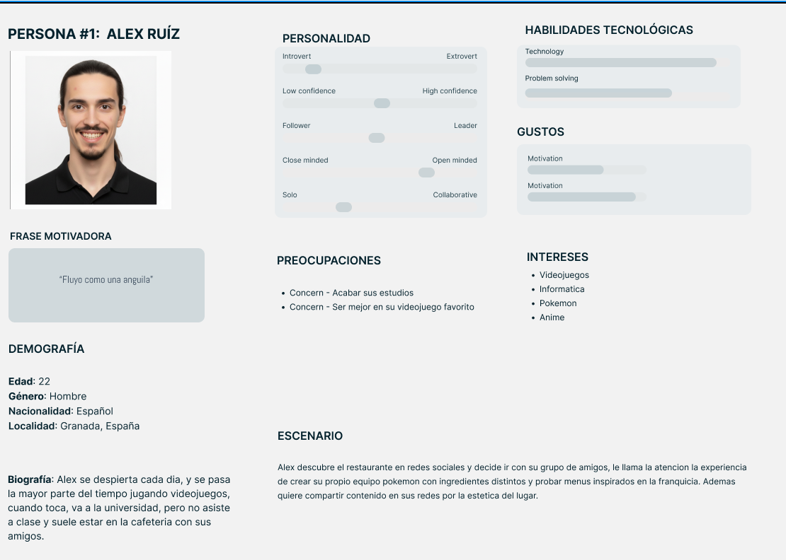

>>> 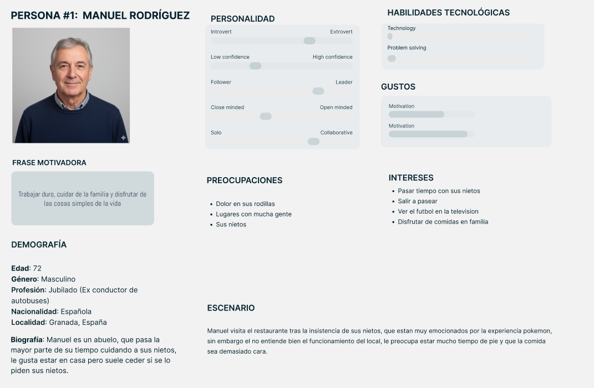

### 1.d User Journey Map
 
----

Las dos experiencias que hemos definido en el journey map (Manuel y Alex) no son casuales: responden a diferencias profundas en motivaciones, contexto y relación con la tecnología.

>>> 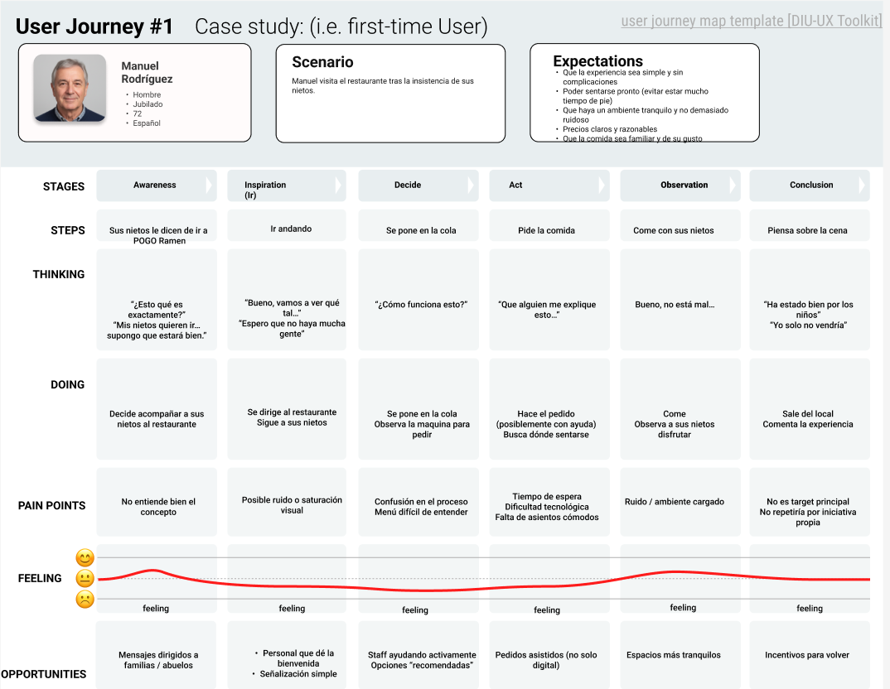
>>> 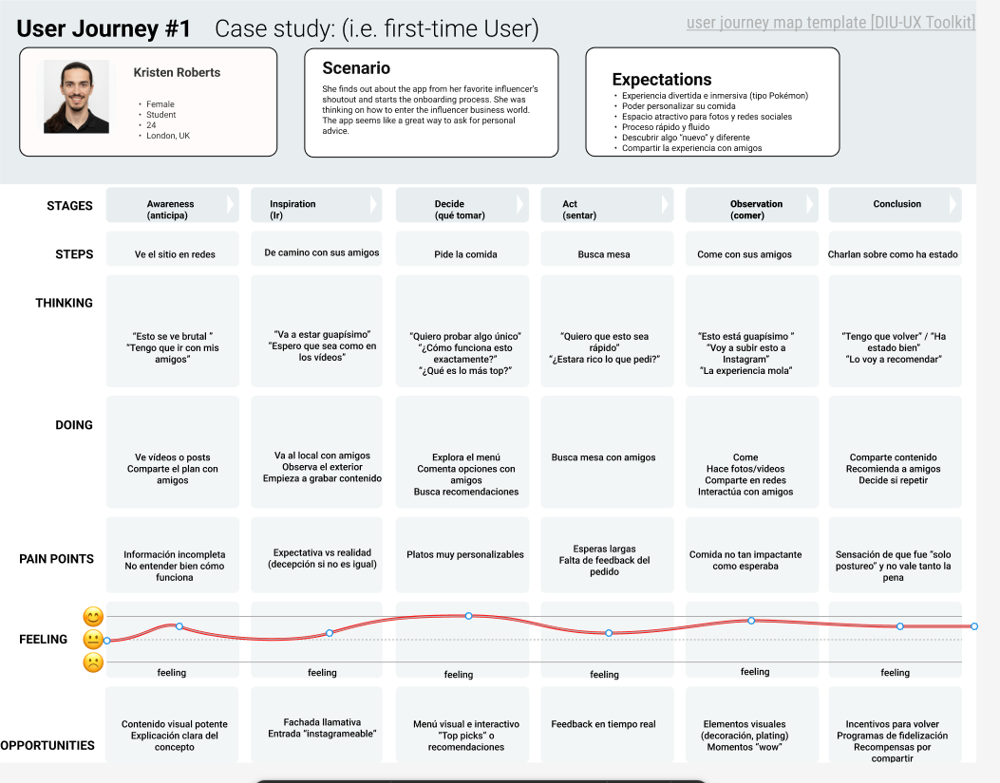

### 1.e Usability Review
 
----

Enlace al documento:  >>> [UsabilityReview](https://github.com/Mercenari23/UX_CaseStudy/blob/2685376d56cd9de49a38c0cf9bcdc265c8b9f6c9/P1/img/UR.xlsx)

URL y Valoración numérica obtenida: 56 (Moderate).

Puntos fuertes detectados:

La accesibilidad a la página y la carga rápida de esta hace que mejore la web funcione perfectamente y mejore la experiencia del usuario. 
Buena página de inicio.
No hay sobrecarga de contenido.

Puntos débiles detectados:
Falta de formularios, no hay variedad de opciones.
No hay un buscador para las reservas en tu ciudad y/o la carta.
No hay un apartado de ayuda.
No hay mensajes de error bien definidos y concisos, solo en un apartado de la página.
El texto se hace poco legible en partes de la página donde el contraste de colores no es del todo apropiado.
La navegación se vuelve un poco dificultosa por la ausencia de botones para volver atrás.

 

## Paso 2. UX Design  

>>> Cualquier título puede ser adaptado. Recuerda borrar estos comentarios del template en tu documento

### 2.a Reframing / IDEACION: Feedback Capture Grid / EMpathy map 
 
----

A partir del análisis de la práctica anterior detectamos una oportunidad clara en el mercado de restauración temática. La competencia ofrece experiencias visualmente atractivas, pero presenta varias limitaciones desde el punto de vista de la experiencia de usuario: menús poco flexibles, escasa ayuda durante el proceso de elección, navegación mejorable, poca personalización, falta de herramientas de búsqueda y una propuesta temática que en muchos casos se queda solo en lo decorativo. Estas debilidades nos permiten replantear el problema no como “hacer otro restaurante anime”, sino como diseñar una experiencia gastronómica temática que sea inmersiva, comprensible, personalizada y fácil de usar.

Nuestro usuario busca algo más que comer: quiere una experiencia divertida, compartible y con identidad propia. Sin embargo, también necesita claridad a la hora de elegir, entender bien los ingredientes, recibir ayuda en el proceso y completar el pedido sin fricción. Esto es especialmente importante en un concepto como el nuestro, donde la personalización del plato forma parte central de la experiencia.

Problema de diseño: los restaurantes temáticos existentes generan interés por su estética, pero no siempre convierten esa atracción inicial en una experiencia digital y presencial clara, personalizada y memorable. La falta de orientación, personalización bien guiada y continuidad entre el concepto temático y la interacción real hace que el valor percibido disminuya.

Hipótesis: si diseñamos una experiencia de pedido basada en una metáfora reconocible para el público objetivo —un “PC Pokémon” desde el que crear tu equipo de 6 ingredientes—, con navegación simple, ayudas visuales, opciones claras y recompensas mediante un sistema de medallas, entonces aumentará la satisfacción del usuario, la sensación de inmersión y la probabilidad de repetición.

Propuesta de valor: PokéBowl League combina restauración temática e interfaz guiada para que el usuario no solo consuma comida, sino que “forme su equipo”, descubra platos inspirados en entrenadores y gimnasios, y reciba recompensas por volver. El valor diferencial no está solo en la ambientación, sino en transformar el pedido en una experiencia jugable, comprensible y socialmente compartible.

A continuación hemos hecho un Empathy Map para destacar los puntos más importantes para esas personas que están de algún modo interesadas con nuestro producto. Nos sirve para saber que es lo bueno y malo de nuestro producto y cómo se sienten nuestros clientes respecto a ello.

### 2.b ScopeCanvas

----

Se ha elaborado un ScopeCanvas para definir el alcance funcional y estratégico de POGO RAMEN. En él se recoge como idea principal el diseño de una experiencia digital de pedido para un restaurante temático Pokémon orientado a jóvenes y adultos fans del anime, la cultura pop y la comida japonesa.

Los objetivos del producto son:

facilitar un proceso de pedido claro y entretenido;
permitir la personalización del plato de forma guiada;
reforzar la inmersión temática mediante metáforas del universo Pokémon;
fomentar la repetición con un sistema de fidelización basado en medallas;
mejorar la visibilidad social del restaurante gracias a una experiencia visualmente compartible.

Las funcionalidades prioritarias definidas en el ScopeCanvas son: exploración de la carta, creación de plato personalizado “equipo de 6”, selección de menús temáticos, visualización de ingredientes y alérgenos, reserva de mesa, consulta del estado del pedido y acceso al sistema de medallas o recompensas. Como funcionalidades secundarias se contemplan compartir platos en redes, guardar combinaciones favoritas y repetir pedidos anteriores.

Con este canvas delimitamos el MVP del producto en torno a la experiencia de pedido y reserva, dejando para fases posteriores funciones de comunidad y personalización avanzada.

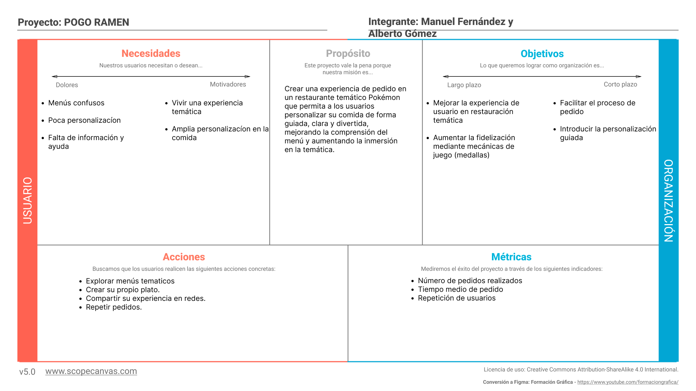

### 2.b User Flow (task) analysis 
 
-----

Se ha definido un User Flow centrado en la tarea principal del sistema: realizar un pedido personalizado en el restaurante. Esta tarea representa el núcleo de la propuesta de valor, ya que convierte la elección de comida en una experiencia temática inspirada en la construcción de un “equipo Pokémon”.

El flujo principal comienza cuando el usuario accede a la pantalla inicial del sistema de pedido. Desde ahí puede elegir entre consultar la carta general, reservar mesa o iniciar directamente la creación de su plato. Si selecciona la opción de creación personalizada, el sistema le guía paso a paso para elegir base, proteínas, toppings, salsas y extras, mostrando nombres, descripciones e información relevante para evitar confusión. Una vez completado el “equipo de 6”, el usuario revisa el resumen del pedido, confirma, añade posibles complementos y finaliza el proceso. Finalmente recibe una confirmación y, si está registrado, se actualiza su progreso en la tarjeta de medallas.

También se han contemplado flujos secundarios como consultar menús temáticos ya preparados, repetir un pedido anterior, revisar alérgenos o hacer una reserva. Estos recorridos secundarios ayudan a cubrir perfiles de usuario distintos: desde quien quiere experimentar y personalizar hasta quien busca rapidez y comodidad.

El análisis de tareas nos permite reducir fricciones detectadas en la competencia, sobre todo en claridad del menú, orientación del usuario y facilidad de navegación.

### 2.c IA: Sitemap + Labelling 
 
----

Sitemap:

Labelling:

Término | Significado     
| ------------- | -------
  Entrar  | Acceder a la página principal
  Continuar con Google | Iniciar sesión con Google
  Continuar con Facebook | Iniciar sesión con Facebook
  Volver al inicio | Volver a la página principal
  Sistema PC Pokémon | Puedes mirar tu equipo
  Menú principal | Puedes mirar el menú principal 
  Crear tu equipo | Crear tu equipo (plato)
  Menús entrenadores | Menús de platos hechos (1-1)
  Ligas regionales | Menús de varios platos con misma temática
  Tu tarjeta | Puedes ver tus "medallas"
  Añadir alimento | Añadir alimento al equipo (plato)
  Tu equipo | Puedes ver los alimentos que tienes
  Volver | Volver a la página de atrás
  Añadir | Añadir al carro
  Tu pedido | Ver lo que tienes en el pedido (alimentos/platos)
  Confirmar pedido | Confirmar el pedido
  Seguir comprando | Seguir comprando en la app
  Escanea para validar | QR para diversas ofertas
  
  

### 2.d Wireframes
 
-----

En esta fase se han desarrollado distintos wireframes en baja fidelidad con el objetivo de definir la estructura, navegación y distribución de contenidos del sistema antes de aplicar el diseño visual final. Para su elaboración se han utilizado herramientas como Figma y Balsamiq, lo que ha permitido iterar de forma rápida y centrarse en la funcionalidad y la experiencia de usuario.

Los wireframes representan las principales pantallas del sistema de pedido del restaurante temático, cubriendo tanto el flujo principal como funcionalidades secundarias clave. A través de ellos se ha buscado simplificar la interacción del usuario, mejorar la comprensión del menú y reforzar la temática del producto sin comprometer la claridad.

En conjunto, estos wireframes permiten validar la arquitectura de la información, los flujos de navegación y las decisiones de diseño antes de avanzar a fases de mayor fidelidad. Además, aseguran que la experiencia propuesta sea coherente, accesible y alineada con las necesidades detectadas en fases anteriores.

## Imágenes de wireframes

Así se ve la página principal del sistema.  
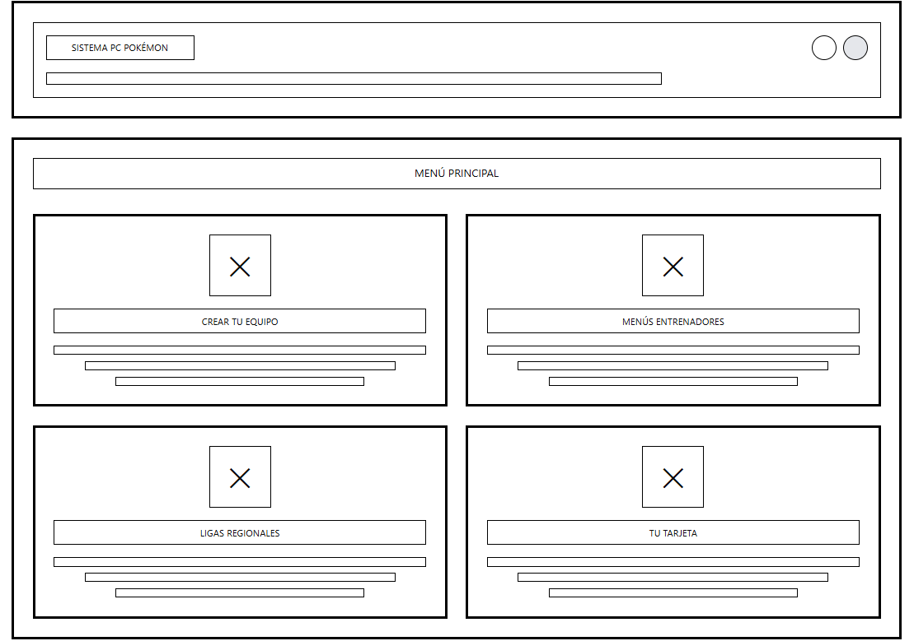

Así se ve la creación del equipo de 6 o menú personalizado.    
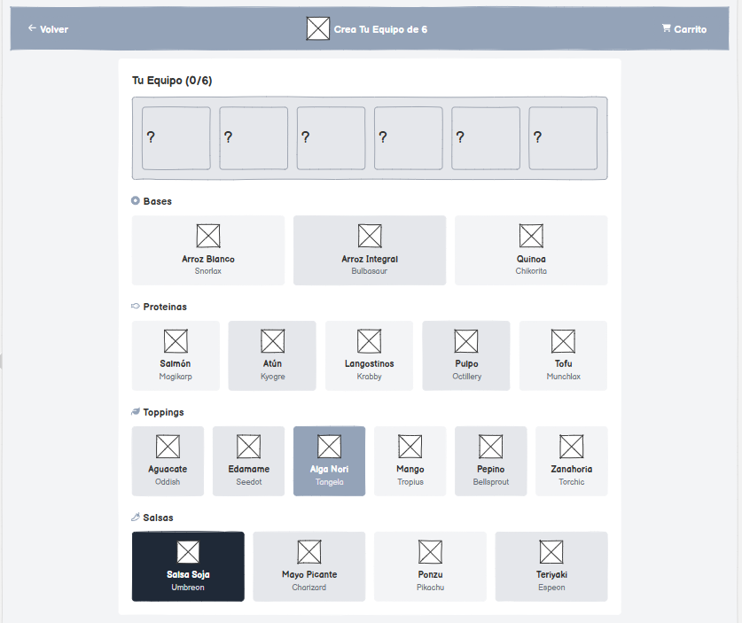

Así se ve el menú de entrenadores.   
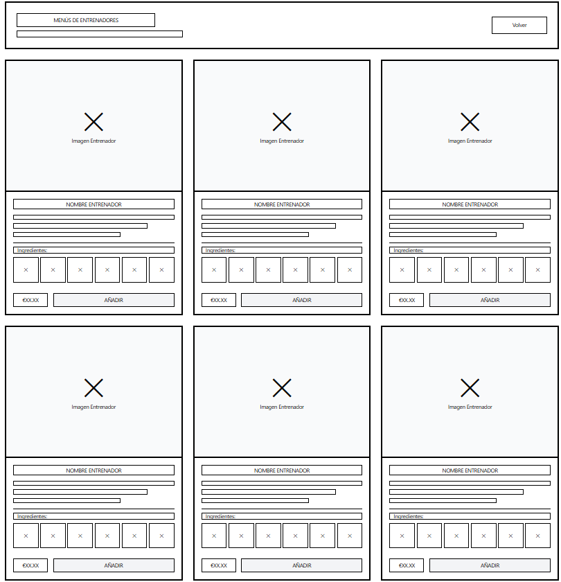

Así se ve el menú de ligas.  
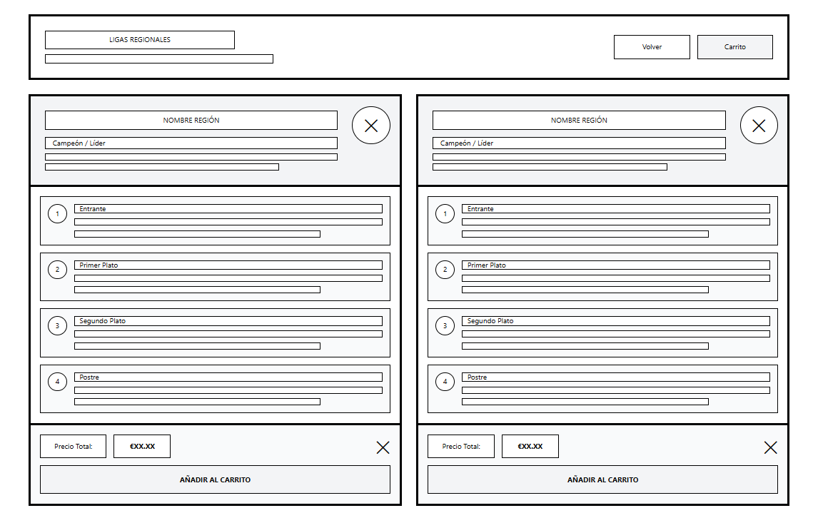

Así se ve el carrito de compra.   
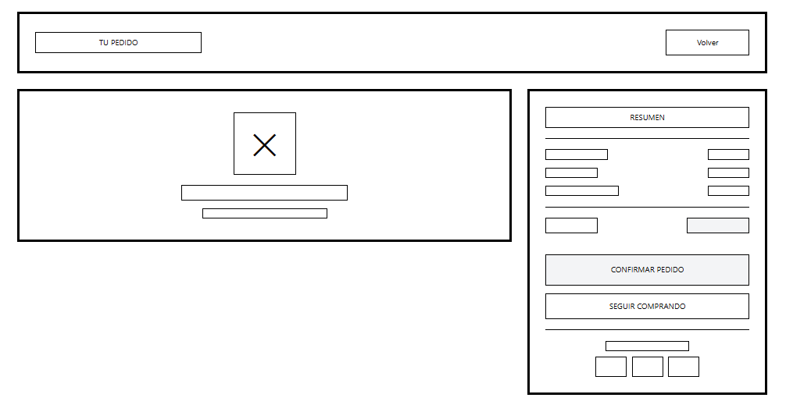

Así se ve el sistema de inicio de sesión.   
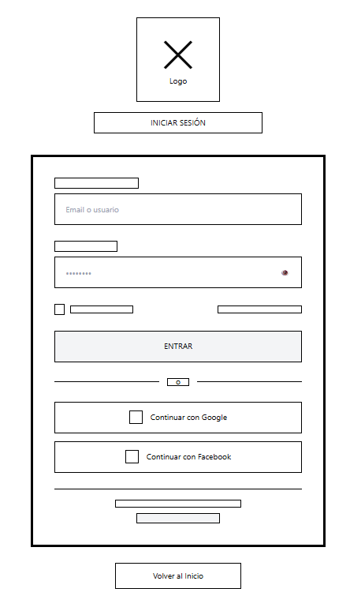

Así se ve el sistema de fidelización. 
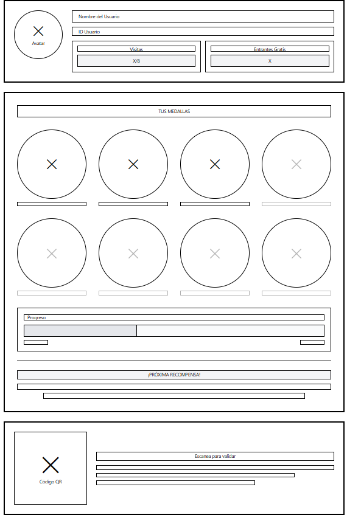

Así se ve la web del usuario.  
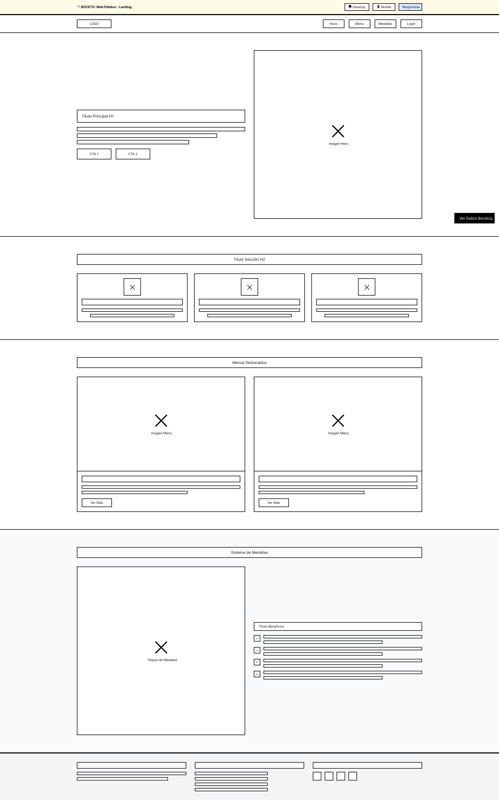

 

## Paso 3. Mi UX-Case Study (diseño)

>>> Cualquier título puede ser adaptado. Recuerda borrar estos comentarios del template en tu documento

### 3.a Moodboard

-----

>>> Diseño visual con una guía de estilos visual (moodboard) 
>>> Incluir Logotipo. Todos los recursos estarán subidos a la carpeta P3/
>>> Explique aqui la/s herramienta/s utilizada/s y el por qué de la resolución empleada. Reflexione ¿Se puede usar esta imagen como cabecera de Instagram, por ejemplo, o se necesitan otras?

### 3.b Landing Page
 
----

>>> Plantear el Landing Page del producto. Aplica estilos definidos en el moodboard

### 3.c Guidelines
 
----

>>> Estudio de Guidelines y explicación de los Patrones IU a usar 
>>> Es decir, tras documentarse, muestre las deciones tomadas sobre Patrones IU a usar para la fase siguiente de prototipado. 

### 3.d Mockup
 
----

>>> Consiste en tener un Layout en acción. Un Mockup es un prototipo HTML que permite simular tareas con estilo de IU seleccionado. Muy útil para compartir con stakeholders

 

## Paso 4. Pruebas de Evaluación 

### 4.a Reclutamiento de usuarios 

-----

>>> Breve descripción del caso asignado (llamado Caso-B) con enlace al repositorio Github
>>> Tabla y asignación de personas ficticias (o reales) a las pruebas. Exprese las ideas de posibles situaciones conflictivas de esa persona en las propuestas evaluadas. Mínimo 4 usuarios: asigne 2 al Caso A y 2 al caso B.

| Usuarios | Sexo/Edad     | Ocupación   |  Exp.TIC    | Personalidad | Plataforma | Caso
| ------------- | -------- | ----------- | ----------- | -----------  | ---------- | ----
| User1's name  | H / 18   | Estudiante  | Media       | Introvertido | Web.       | A 
| User2's name  | H / 18   | Estudiante  | Media       | Timido       | Web        | A 
| User3's name  | M / 35   | Abogado     | Baja        | Emocional    | móvil      | B 
| User4's name  | H / 18   | Estudiante  | Media       | Racional     | Web        | B 

### 4.b Diseño de las pruebas 
 
-----

>>> Planifique qué pruebas se van a desarrollar. ¿En qué consisten? ¿Se hará uso del checklist de la P1?

### 4.c Cuestionario SUS
 
----

>>> Como uno de los test para la prueba A/B testing, usaremos el **Cuestionario SUS** que permite valorar la satisfacción de cada usuario con el diseño utilizado (casos A o B). Para calcular la valoración numérica y la etiqueta linguistica resultante usamos la [hoja de cálculo](https://github.com/mgea/DIU19/blob/master/Cuestionario%20SUS%20DIU.xlsx). Previamente conozca en qué consiste la escala SUS y cómo se interpretan sus resultados
http://usabilitygeek.com/how-to-use-the-system-usability-scale-sus-to-evaluate-the-usability-of-your-website/)
Para más información, consultar aquí sobre la [metodología SUS](https://cui.unige.ch/isi/icle-wiki/_media/ipm:test-suschapt.pdf)
>>> Adjuntar en la carpeta P4/ el excel resultante y describa aquí la valoración personal de los resultados 

### 4.d A/B Testing
 
-----

>>> Los resultados de un A/B testing con 3 pruebas y 2 casos o alternativas daría como resultado una tabla de 3 filas y 2 columnas, además de un resultado agregado global. Especifique con claridad el resultado: qué caso es más usable, A o B?

### 4.e Aplicación del método Eye Tracking 

----

>>> Indica cómo se diseña el experimento y se reclutan los usuarios. Explica la herramienta / uso de gazerecorder.com u otra similar. Aplíquese únicamente al caso B.

  
>>> Cambiar esta img por una de vuestro experimento. El recurso deberá estar subido a la carpeta P4/  

>>> gazerecorder en versión de pruebas puede estar limitada a 3 usuarios para generar mapa de calor (crédito > 0 para que funcione) 

### 4.f Usability Report de B
 
-----

>>> Añadir report de usabilidad para práctica B (la de los compañeros) aportando resultados y valoración de cada debilidad de usabilidad. 
>>> Enlazar aqui con el archivo subido a P4/ que indica qué equipo evalua a qué otro equipo.

>>> Complementad el Case Study en su Paso 4 con una Valoración personal del equipo sobre esta tarea

 

## Paso 5. Exportación y Documentación 

### 5.a Exportación a HTML/React
 
----

>>> Breve descripción de esta tarea. Las evidencias de este paso quedan subidas a P5/

### 5.b Documentación con Storybook

----

>>> Breve descripción de esta tarea. Las evidencias de este paso quedan subidas a P5/

 

## Conclusiones finales & Valoración de las prácticas

>>> Opinión FINAL del proceso de desarrollo de diseño siguiendo metodología UX y valoración (positiva /negativa) de los resultados obtenidos. ¿Qué se puede mejorar? Recuerda que este tipo de texto se debe eliminar del template que se os proporciona 

