# DIU26
Prácticas Diseño Interfaces de Usuario (Tema: .... ) 

* [Guiones de prácticas](GuionesPracticas/)
* [Guía para crea tu Case Study](Guia_CaseStudy.md)
* Sala de la Fama [DIU Hall of fame](https://github.com/mgea/DIU/tree/master/hall_of_fame) donde se pueden encontrar Case Study destacados de otros años.

Actualizado: 14/01/2026

## Paso 0 My UX-Case Study
 
-----

Grupo: DIU1.Pogo  Curso: 2025/26 

Nombre del Proyecto: 

>>> Decida el nombre corto de su propuesta en la práctica 2 

Descripción: 

Nuestra idea de proyecto es un restaurante temático de Pokémon donde los clientes puedan crear sus propios platos estilo poke formando su “equipo de 6” con ingredientes que representen distintos Pokémon. También ofreceremos platos inspirados en entrenadores famosos como Misty o Brock, y menús especiales de 4 platos basados en líderes y campeones de las ligas de distintas regiones como Johto, Kalos o Teselia.

Los pedidos se realizarán en una máquina que simula ser un PC Pokémon, similar a un puesto de pedido automático, desde donde los clientes podrán elegir sus platos antes de recibir el servicio en mesa. Además, el restaurante contará con un sistema de fidelización en forma de tarjeta de medallas, donde a los clientes que repitan se les sellará una medalla en cada visita y, al conseguir las 8 medallas, obtendrán un entrante gratis.

La página web

Logotipo: 
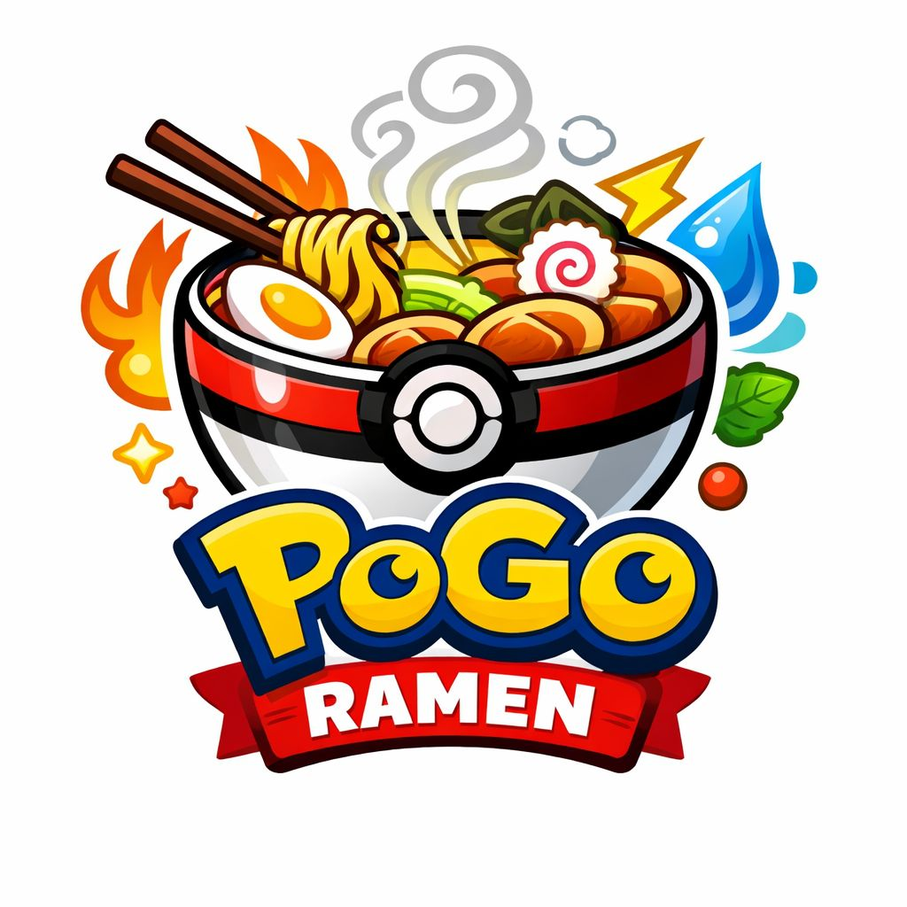

Miembros y nombre del equipo:
 * DIU1.Pogo
 * :bust_in_silhouette:  Alberto David Gómez Gijón: https://github.com/Mercenari23     :octocat:     
 * :bust_in_silhouette:  Manuel José Fernández Poyatos: https://github.com/ManuehFernandez     :octocat:

----- 

 

# Proceso de Diseño 

 

## Paso 1. UX User & Desk Research & Analisis 

### 1.a User Reseach Plan
 
-----
Hemos elegido para la investigación el restaurante Hanazono L'Eliana, ubicado en Valencia, que se caracteriza por su ambientación inspirada en la comida japonesa y el mundo del anime, lo cual hace que conecte fuertemente con el público joven. Esto es debido a cómo está ambientado por dentro, ya que cuenta con elementos visuales, decorativos y conceptuales que hace que disfrutes de una experiencia inmersiva.

Hemos realizado la investigación porque uno de nuestros principales objetivos es que el cliente conecte con el restaurante y con nosotros de una forma que no hayan experimentado todavía. Es por ello que hemos elegido el restaurante Hanazono L'Eliana. También se pretende mejorar la diversidad a la hora de los platos de comida, ya que por nuestra idea, debemos tener una amplia variedad de comida.

Por último, tener un buen engagement en redes sociales, al igual que Hanazono L'Eliana, con la ayuda de la estética y presentación de los platos para así motivar a los usuarios compartir contenido del restaurante.

Para llevar a cabo la investigación, se empleará una combinación de entrevistas y encuestas con el objetivo de obtener una visión completa tanto del interés de los usuarios como de su percepción de nuestro concepto.

En primer lugar, se realizarán encuestas online dirigidas a personas entre 18 y 35 años interesadas en Pokémon o en restaurantes temáticos(sobre todo con el anime). Estas encuestas permitirán saber sobre el nivel de interés en el concepto, las preferencias de los usuarios y su percepción inicial del restaurante.

En segundo lugar, se llevarán a cabo entrevistas semiestructuradas, es decir, una mezcla de preguntas ya definidas y temas de conversación no definidos antes de la conversación, con el objetivo de profundizar en las opiniones, motivaciones y expectativas de los usuarios. Esto permitirá entender mejor qué elementos del mundo Pokémon resultan más atractivos y cómo interpretan la propuesta del restaurante.
>>> 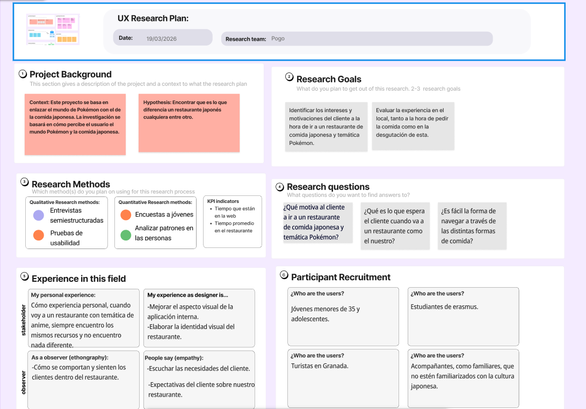

### 1.b Competitive Analysis
 
-----

Para el análisis competitivo hemos elegido dos restuarantes enlazados con el ramen, Ramen Shifu y Otaku Ramen.

Ramen Shifu: Es una cadena de restaurantes con varios locales en España. Su modelo se basa tener una experiencia temática ligera que atrae un gran público. Ofrece una carta que se centra en ramen pero con acompañamientos japoneses como pueden ser gyozas por ejemplo. La carta es clara y reconocible, algo a tener en cuenta, y la tematización no interfiere en esta.
La experiencia es ágil y eficiente, lo cual hace que el usuario entre y consuma sin problemas. La forma de conectar con el público es a través de la estética visual y de redes sociales.

Ramen Otaku: Es un restaurante que está más enfocado al público que le gusta el anime y el manga. Por ello la tematización es más intensa que por ejemplo, el Ramen Shifu, haciendo más incapié en la caracterización de los platos y ambientación. Una diferencia principal respecto al anterior es en el menú, teniendo este más peso en el concepto sobre la claridad.
La experiencia del usuario es más inmersiva que la anterior, y este se ve atraído por el contenido visual que atractivo que se hace en redes sociales.
>>> 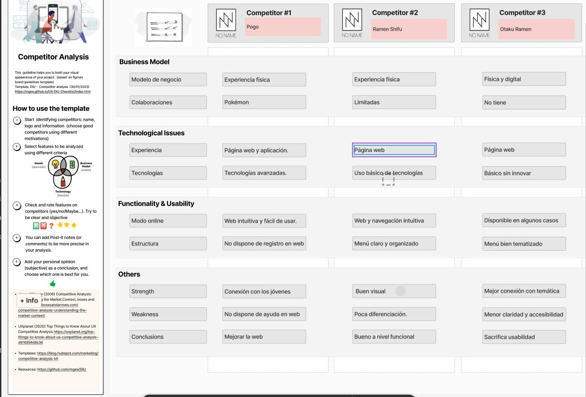
### 1.c Personas
 
-----
  
Para el desarrollo de este proyecto hemos creado a dos personas ficticias,Alex y Miguel, para intentar ponernos en su lugar, dejando de lado nuestras inquietudes y empatizar con las necesidades de usuarios variados.

>>> 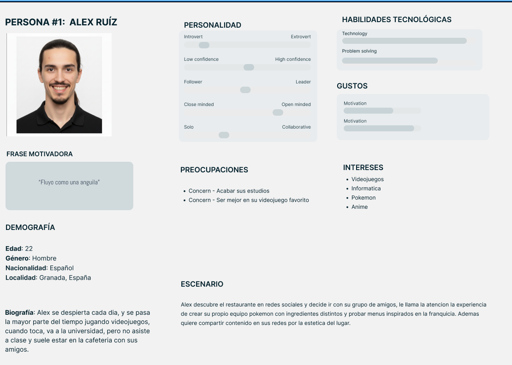

>>> 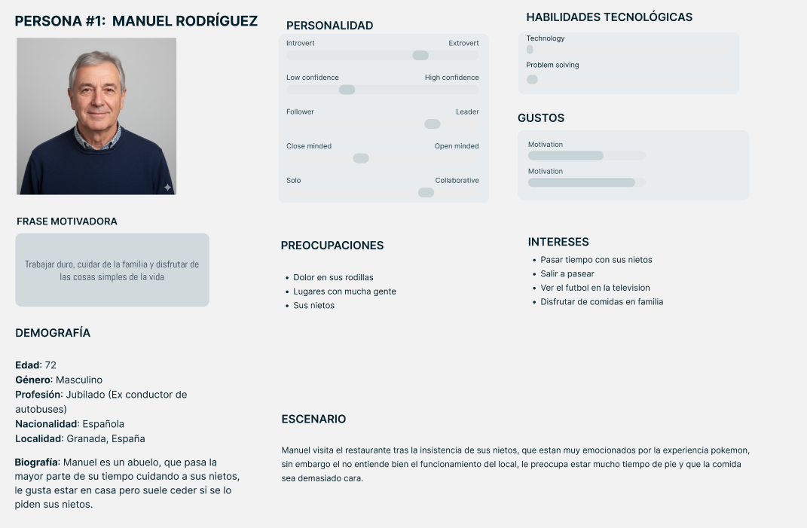

### 1.d User Journey Map
 
----

Las dos experiencias que hemos definido en el journey map (Manuel y Alex) no son casuales: responden a diferencias profundas en motivaciones, contexto y relación con la tecnología.

>>> 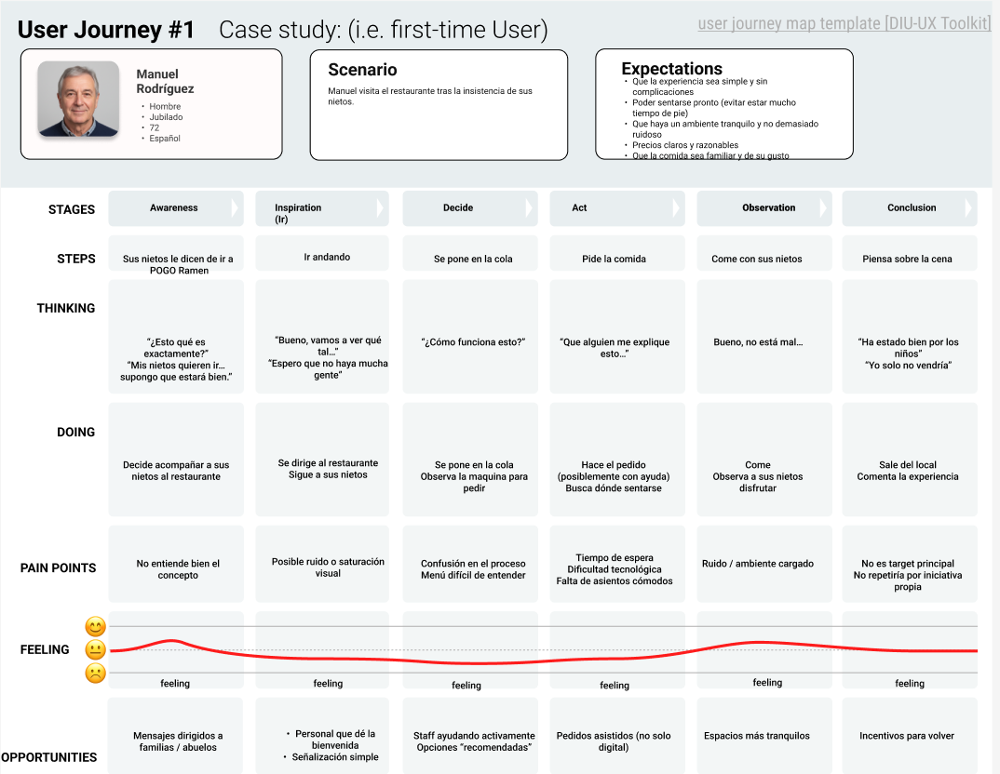
>>> 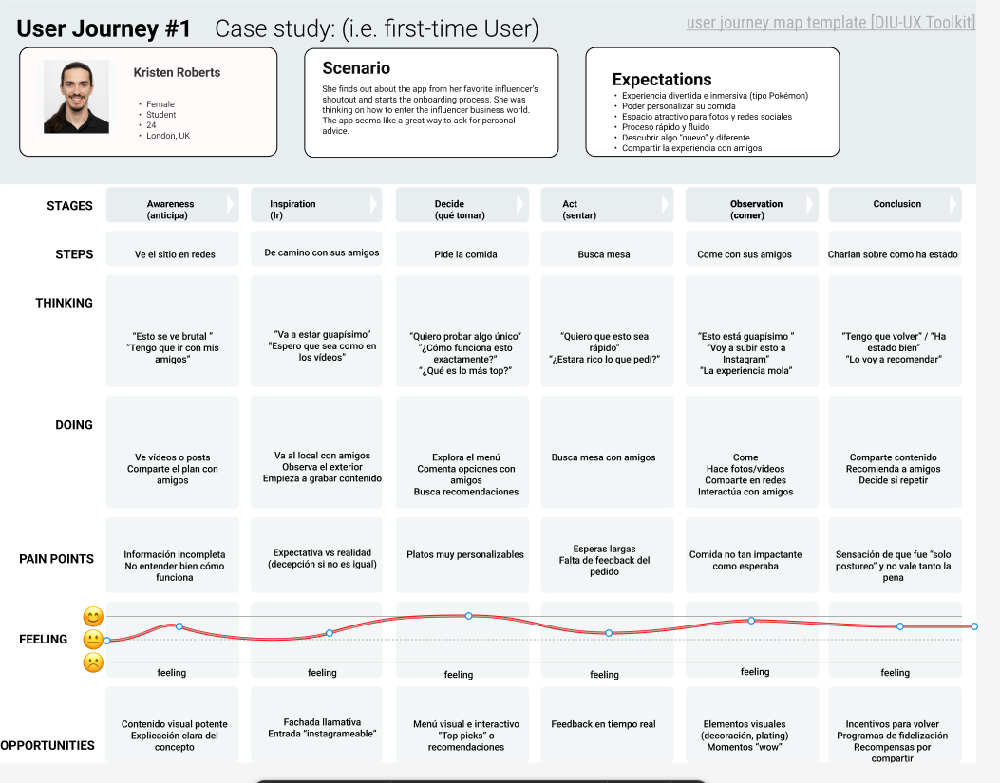

### 1.e Usability Review
 
----

Enlace al documento:  >>> [UsabilityReview](https://github.com/Mercenari23/UX_CaseStudy/blob/2685376d56cd9de49a38c0cf9bcdc265c8b9f6c9/P1/img/UR.xlsx)

URL y Valoración numérica obtenida: 56 (Moderate).

Puntos fuertes detectados:

La accesibilidad a la página y la carga rápida de esta hace que mejore la web funcione perfectamente y mejore la experiencia del usuario. 
Buena página de inicio.
No hay sobrecarga de contenido.

Puntos débiles detectados:
Falta de formularios, no hay variedad de opciones.
No hay un buscador para las reservas en tu ciudad y/o la carta.
No hay un apartado de ayuda.
No hay mensajes de error bien definidos y concisos, solo en un apartado de la página.
El texto se hace poco legible en partes de la página donde el contraste de colores no es del todo apropiado.
La navegación se vuelve un poco dificultosa por la ausencia de botones para volver atrás.

 

## Paso 2. UX Design  

>>> Cualquier título puede ser adaptado. Recuerda borrar estos comentarios del template en tu documento

### 2.a Reframing / IDEACION: Feedback Capture Grid / EMpathy map 
 
----

A partir del análisis de la práctica anterior detectamos una oportunidad clara en el mercado de restauración temática. La competencia ofrece experiencias visualmente atractivas, pero presenta varias limitaciones desde el punto de vista de la experiencia de usuario: menús poco flexibles, escasa ayuda durante el proceso de elección, navegación mejorable, poca personalización, falta de herramientas de búsqueda y una propuesta temática que en muchos casos se queda solo en lo decorativo. Estas debilidades nos permiten replantear el problema no como “hacer otro restaurante anime”, sino como diseñar una experiencia gastronómica temática que sea inmersiva, comprensible, personalizada y fácil de usar.

Nuestro usuario busca algo más que comer: quiere una experiencia divertida, compartible y con identidad propia. Sin embargo, también necesita claridad a la hora de elegir, entender bien los ingredientes, recibir ayuda en el proceso y completar el pedido sin fricción. Esto es especialmente importante en un concepto como el nuestro, donde la personalización del plato forma parte central de la experiencia.

Problema de diseño: los restaurantes temáticos existentes generan interés por su estética, pero no siempre convierten esa atracción inicial en una experiencia digital y presencial clara, personalizada y memorable. La falta de orientación, personalización bien guiada y continuidad entre el concepto temático y la interacción real hace que el valor percibido disminuya.

Hipótesis: si diseñamos una experiencia de pedido basada en una metáfora reconocible para el público objetivo —un “PC Pokémon” desde el que crear tu equipo de 6 ingredientes—, con navegación simple, ayudas visuales, opciones claras y recompensas mediante un sistema de medallas, entonces aumentará la satisfacción del usuario, la sensación de inmersión y la probabilidad de repetición.

Propuesta de valor: PokéBowl League combina restauración temática e interfaz guiada para que el usuario no solo consuma comida, sino que “forme su equipo”, descubra platos inspirados en entrenadores y gimnasios, y reciba recompensas por volver. El valor diferencial no está solo en la ambientación, sino en transformar el pedido en una experiencia jugable, comprensible y socialmente compartible.

A continuación hemos hecho un Empathy Map para destacar los puntos más importantes para esas personas que están de algún modo interesadas con nuestro producto. Nos sirve para saber que es lo bueno y malo de nuestro producto y cómo se sienten nuestros clientes respecto a ello.

### 2.b ScopeCanvas

----

Se ha elaborado un ScopeCanvas para definir el alcance funcional y estratégico de POGO RAMEN. En él se recoge como idea principal el diseño de una experiencia digital de pedido para un restaurante temático Pokémon orientado a jóvenes y adultos fans del anime, la cultura pop y la comida japonesa.

Los objetivos del producto son:

facilitar un proceso de pedido claro y entretenido;
permitir la personalización del plato de forma guiada;
reforzar la inmersión temática mediante metáforas del universo Pokémon;
fomentar la repetición con un sistema de fidelización basado en medallas;
mejorar la visibilidad social del restaurante gracias a una experiencia visualmente compartible.

Las funcionalidades prioritarias definidas en el ScopeCanvas son: exploración de la carta, creación de plato personalizado “equipo de 6”, selección de menús temáticos, visualización de ingredientes y alérgenos, reserva de mesa, consulta del estado del pedido y acceso al sistema de medallas o recompensas. Como funcionalidades secundarias se contemplan compartir platos en redes, guardar combinaciones favoritas y repetir pedidos anteriores.

Con este canvas delimitamos el MVP del producto en torno a la experiencia de pedido y reserva, dejando para fases posteriores funciones de comunidad y personalización avanzada.

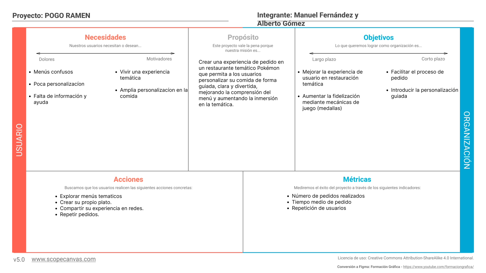

### 2.b User Flow (task) analysis 
 
-----

Se ha definido un User Flow centrado en la tarea principal del sistema: realizar un pedido personalizado en el restaurante. Esta tarea representa el núcleo de la propuesta de valor, ya que convierte la elección de comida en una experiencia temática inspirada en la construcción de un “equipo Pokémon”.

El flujo principal comienza cuando el usuario accede a la pantalla inicial del sistema de pedido. Desde ahí puede elegir entre consultar la carta general, reservar mesa o iniciar directamente la creación de su plato. Si selecciona la opción de creación personalizada, el sistema le guía paso a paso para elegir base, proteínas, toppings, salsas y extras, mostrando nombres, descripciones e información relevante para evitar confusión. Una vez completado el “equipo de 6”, el usuario revisa el resumen del pedido, confirma, añade posibles complementos y finaliza el proceso. Finalmente recibe una confirmación y, si está registrado, se actualiza su progreso en la tarjeta de medallas.

También se han contemplado flujos secundarios como consultar menús temáticos ya preparados, repetir un pedido anterior, revisar alérgenos o hacer una reserva. Estos recorridos secundarios ayudan a cubrir perfiles de usuario distintos: desde quien quiere experimentar y personalizar hasta quien busca rapidez y comodidad.

El análisis de tareas nos permite reducir fricciones detectadas en la competencia, sobre todo en claridad del menú, orientación del usuario y facilidad de navegación.

### 2.c IA: Sitemap + Labelling 
 
----

Sitemap:

Labelling:

Término | Significado     
| ------------- | -------
  Entrar  | Acceder a la página principal
  Continuar con Google | Iniciar sesión con Google
  Continuar con Facebook | Iniciar sesión con Facebook
  Volver al inicio | Volver a la página principal
  Sistema PC Pokémon | Puedes mirar tu equipo
  Menú principal | Puedes mirar el menú principal 
  Crear tu equipo | Crear tu equipo (plato)
  Menús entrenadores | Menús de platos hechos (1-1)
  Ligas regionales | Menús de varios platos con misma temática
  Tu tarjeta | Puedes ver tus "medallas"
  Añadir alimento | Añadir alimento al equipo (plato)
  Tu equipo | Puedes ver los alimentos que tienes
  Volver | Volver a la página de atrás
  Añadir | Añadir al carro
  Tu pedido | Ver lo que tienes en el pedido (alimentos/platos)
  Confirmar pedido | Confirmar el pedido
  Seguir comprando | Seguir comprando en la app
  Escanea para validar | QR para diversas ofertas
  
  

### 2.d Wireframes
 
-----

En esta fase se han desarrollado distintos wireframes en baja fidelidad con el objetivo de definir la estructura, navegación y distribución de contenidos del sistema antes de aplicar el diseño visual final. Para su elaboración se han utilizado herramientas como Figma y Balsamiq, lo que ha permitido iterar de forma rápida y centrarse en la funcionalidad y la experiencia de usuario.

Los wireframes representan las principales pantallas del sistema de pedido del restaurante temático, cubriendo tanto el flujo principal como funcionalidades secundarias clave. A través de ellos se ha buscado simplificar la interacción del usuario, mejorar la comprensión del menú y reforzar la temática del producto sin comprometer la claridad.

En conjunto, estos wireframes permiten validar la arquitectura de la información, los flujos de navegación y las decisiones de diseño antes de avanzar a fases de mayor fidelidad. Además, aseguran que la experiencia propuesta sea coherente, accesible y alineada con las necesidades detectadas en fases anteriores.

## Imágenes de wireframes

Así se ve la página principal del sistema.  
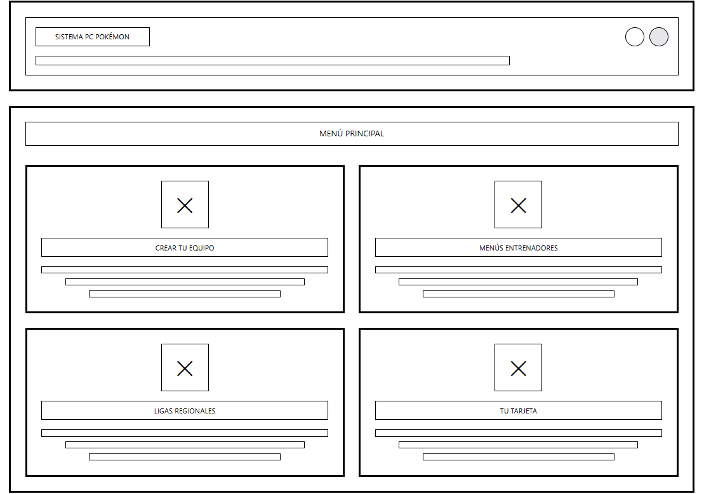

Así se ve la creación del equipo de 6 o menú personalizado.    
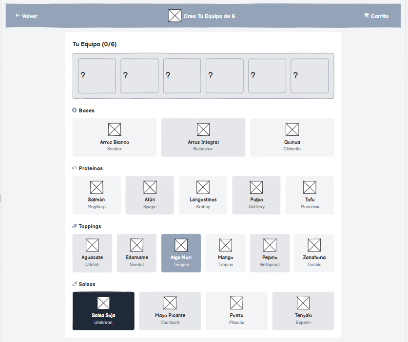

Así se ve el menú de entrenadores.   
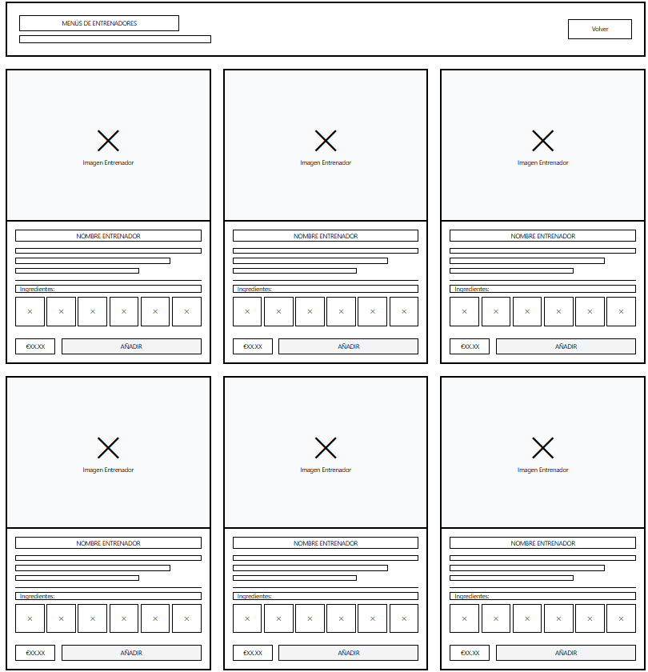

Así se ve el menú de ligas.  
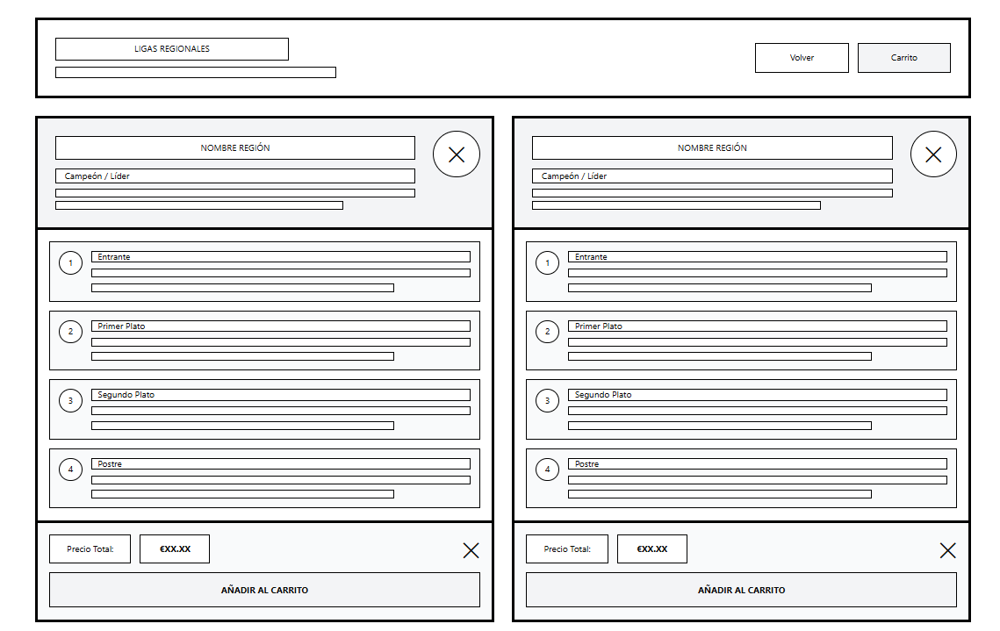

Así se ve el carrito de compra.   
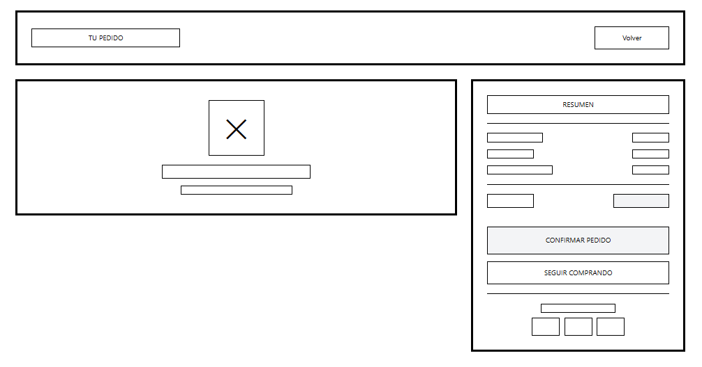

Así se ve el sistema de inicio de sesión.   
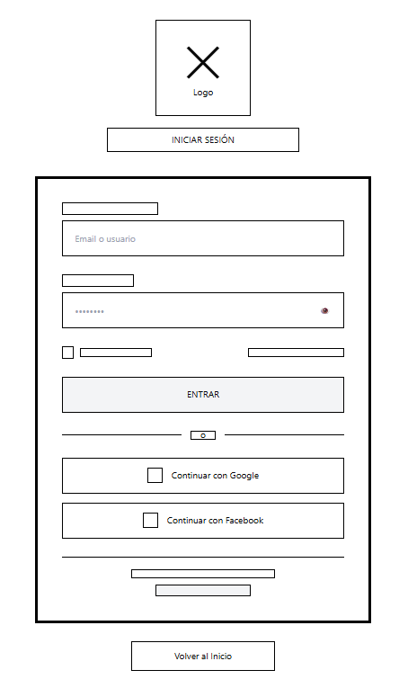

Así se ve el sistema de fidelización. 
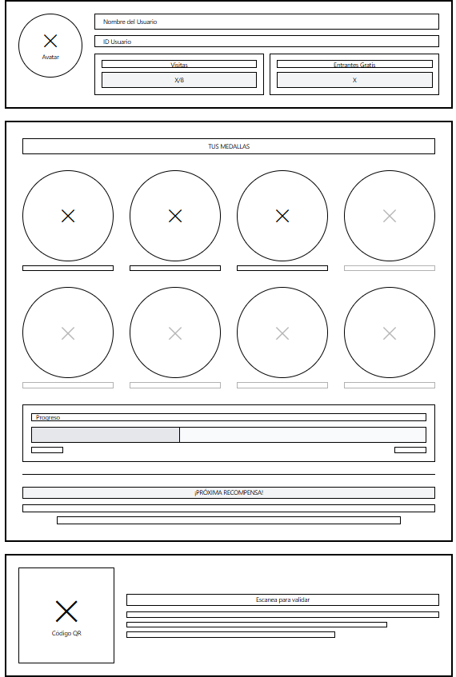

Así se ve la web del usuario.  
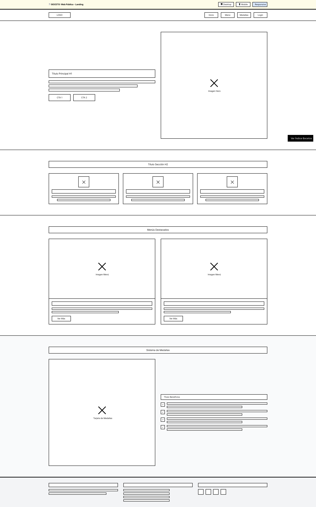

 

## Paso 3. Mi UX-Case Study (diseño)

>>> Cualquier título puede ser adaptado. Recuerda borrar estos comentarios del template en tu documento

### 3.a Moodboard

-----

>>> Diseño visual con una guía de estilos visual (moodboard) 
>>> Incluir Logotipo. Todos los recursos estarán subidos a la carpeta P3/
>>> Explique aqui la/s herramienta/s utilizada/s y el por qué de la resolución empleada. Reflexione ¿Se puede usar esta imagen como cabecera de Instagram, por ejemplo, o se necesitan otras?
 

El moodboard se ha hecho utilizando Figma. Se eligió por su facilidad para crear moodboards y por todo lo que ofrece.

Se ha utilizado una resolución alta para poder tener una buena calidad visual y mantener la legibilidad de todos los elementos del moodboard en la pantalla.

Esta imagen funciona bien como presentación de la identidad visual del proyecto, pero no sería la opción más adecuada como cabecera o publicación principal de Instagram debido a la cantidad de información que contiene, ya que contiene información que quizás no es tan relevante para el cliente. Habría que hacer algo más directo para el cliente, que esté menos cargado y que también tenga la resolución adecuada para poder subirse a Instagram.

### 3.b Landing Page
 
----

>>> Plantear el Landing Page del producto. Aplica estilos definidos en el moodboard

### 3.c Guidelines
 
----

Atomic Design
Para el desarrollo visual de POGO RAMEN hemos aplicado la metodología de Atomic Design, ya que nos permite construir la interfaz de forma ordenada, reutilizable y coherente. Al tratarse de un restaurante temático con una experiencia de pedido personalizada, necesitábamos un sistema visual que no dependiera solo de pantallas aisladas, sino de componentes que pudieran repetirse en distintas partes del producto: carta, creación del plato, carrito, login y sistema de fidelización.

La elección de diseño parte de la identidad del proyecto: un restaurante de ramen y poke inspirado en una experiencia de juego, donde el usuario crea su propio “equipo de 6” ingredientes. Por eso, los colores principales se han tomado de la estética del logo y del concepto del proyecto: el rojo se utiliza para acciones importantes y llamadas a la acción, el azul para navegación y estructura, el amarillo para recompensas y medallas, y los tonos crema para mantener una base cálida relacionada con la comida japonesa.

En los átomos se han definido los elementos mínimos de la interfaz, como botones, chips, campos de texto, medallas, iconos y slots de ingredientes. Estos elementos son la base del sistema y permiten mantener consistencia visual en todas las pantallas. Por ejemplo, los slots representan los huecos del “equipo de 6”, mientras que las medallas refuerzan el sistema de fidelización.

Las moléculas combinan varios átomos para formar elementos con una función concreta, como la tarjeta de ingrediente, la línea del carrito, el selector de equipo o el botón de inicio de sesión. Estas piezas ayudan a que el usuario pueda comparar, seleccionar y revisar información de forma rápida, sin perder claridad.

Los organismos agrupan moléculas para formar bloques completos de la interfaz, como el sistema PC, el constructor del equipo de 6, el carrito o la tarjeta de medallas. Estos organismos representan las partes principales de la experiencia de usuario y conectan la temática del restaurante con acciones reales: elegir comida, confirmar un pedido o consultar recompensas.

>>> 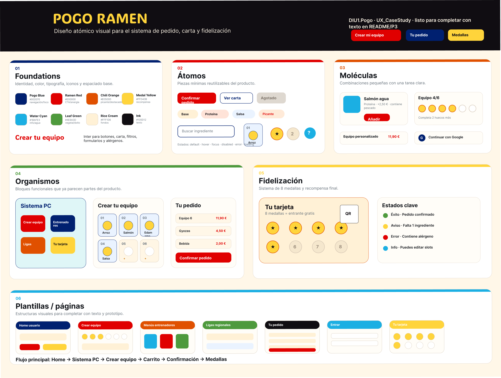

### 3.d Mockup
 
----

>>> Consiste en tener un Layout en acción. Un Mockup es un prototipo HTML que permite simular tareas con estilo de IU seleccionado. Muy útil para compartir con stakeholders
>>> 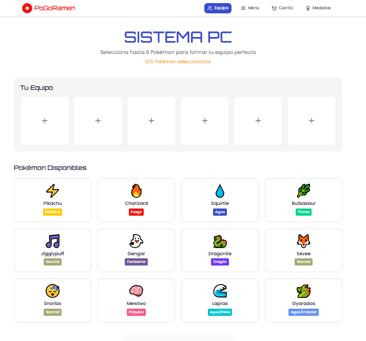
>>> 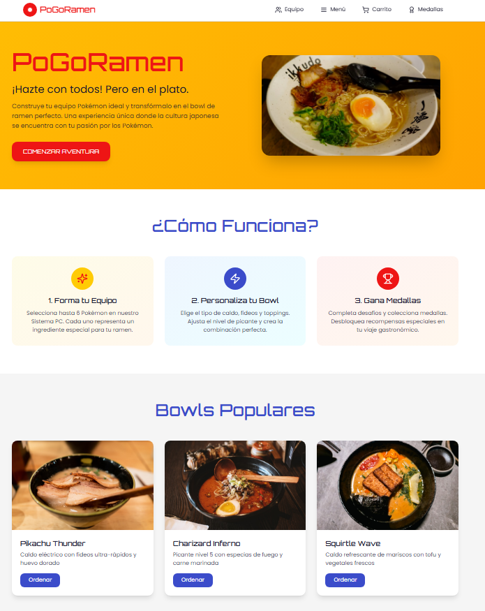
 
https://raft-above-97145235.figma.site
## Paso 4. Pruebas de Evaluación 

# Paso 4. Pruebas de Evaluación

## 4.a Reclutamiento de usuarios

El objetivo de esta fase ha sido comparar la usabilidad percibida y observada entre dos propuestas de restauración digital:

- **Caso A:** nuestra web de POGO RAMEN, disponible en https://pecan-manor-76065982.figma.site. La propuesta se basa en una experiencia temática Pokémon donde el usuario puede explorar menús, construir su “equipo de 6” ingredientes y consultar recompensas.
- **Caso B:** el proyecto **Wall Street Burguer / Goiko's Change** del repositorio https://github.com/DIU3-COMPIS/UX_CaseStudy, disponible en https://www.figma.com/make/RNMefk5sTP5USA9a05kYDV/Crear-aplicación-diseño-atómico?p=f&t=9SY0qMbsscjzjcnD-0&preview-route=%2Fcart. La propuesta transforma la carta de hamburguesas en un mercado gamificado con precios variables, carrito y mecánicas de inversión.

Se seleccionaron usuarios ficticios representativos de distintos niveles de experiencia digital, edad y contexto de uso. La rúbrica exige al menos cuatro usuarios, con dos asignados al Caso A y dos al Caso B; hemos ampliado la muestra a seis para cubrir mejor perfiles con baja experiencia TIC y usuarios jóvenes habituados a interfaces gamificadas.

| Usuario | Sexo/Edad | Ocupación | Exp. TIC | Personalidad | Plataforma | Caso | Posible situación conflictiva |
| ------------- | -------- | ----------- | ----------- | ----------- | ---------- | ---- | ---- |
| Alberto | H / 23 | Estudiante | Alta | Introvertido | Web escritorio | A | Quiere crear un plato personalizado rápido y puede frustrarse si la metáfora del “equipo” no deja claro cuántos ingredientes faltan. |
| Daniela | M / 15 | Estudiante | Media | Extrovertida | Móvil | A | Se guía mucho por elementos visuales; puede confundirse si hay demasiado texto o si los botones de acción no destacan. |
| Sonia | M / 56 | Administrativa | Baja | Emocional | Móvil | A | Necesita orientación clara, botones de volver visibles y mensajes de confirmación para no perderse durante el pedido. |
| Nicolson | H / 21 | Estudiante | Media | Tímido | Web escritorio | B | Entiende el concepto de carrito, pero la metáfora bursátil puede añadir carga cognitiva si solo quiere pedir una hamburguesa. |
| Alberto R. | H / 58 | Técnico | Baja | Racional | Web escritorio | B | Puede interpretar “invertir” como una acción no relacionada con comprar comida y dudar antes de avanzar. |
| Hugo | H / 18 | Estudiante | Alta | Reservado | Web escritorio | B | Disfruta la gamificación, pero puede centrarse demasiado en precios y gráficas y tardar más en finalizar el pedido. |

## 4.b Diseño de las pruebas

Se diseñó una evaluación comparativa A/B con tareas equivalentes para ambos casos. Las pruebas combinan observación directa, checklist de usabilidad, tiempos de finalización, número de errores, comentarios del usuario y cuestionario SUS final.

**Objetivos de evaluación:**

- Comprobar si el usuario entiende la propuesta de valor de cada interfaz en el primer contacto.
- Medir la facilidad para localizar una opción principal de comida.
- Evaluar si el flujo de añadir al carrito y confirmar pedido se completa sin ayuda.
- Detectar problemas de navegación, etiquetado, contraste, jerarquía visual y feedback.
- Comparar cuál de los dos casos resulta más usable según tareas, SUS y observación.

**Tareas definidas:**

| Prueba | Caso A: POGO RAMEN | Caso B: Wall Street Burguer | Métrica principal |
| ------------- | ------------- | ------------- | ------------- |
| T1. Comprensión inicial | Entrar en la web y explicar qué se puede hacer en ella. | Entrar en la app y explicar qué significa el mercado de hamburguesas. | Claridad de propuesta y tiempo hasta comprender la acción principal. |
| T2. Selección de producto | Crear o seleccionar un plato/menú y revisar sus ingredientes. | Elegir una hamburguesa del mercado o carrito y revisar precio/producto. | Éxito de tarea, errores y dudas verbalizadas. |
| T3. Finalización | Añadir el producto al pedido y llegar a una pantalla de revisión/confirmación. | Revisar carrito y avanzar hacia la compra. | Tiempo, pasos necesarios y confianza del usuario. |

**Criterios de observación basados en la rúbrica/checklist:**

- **Eficacia:** el usuario consigue completar la tarea.
- **Eficiencia:** número de pasos y tiempo empleado.
- **Satisfacción:** valoración SUS y comentarios espontáneos.
- **Comprensibilidad:** etiquetas, metáforas y navegación.
- **Accesibilidad básica:** contraste, tamaño de texto, legibilidad y claridad de controles.
- **Feedback:** confirmaciones, estados visibles y prevención de errores.

## 4.c Cuestionario SUS

Para valorar la satisfacción percibida se utilizó el cuestionario **SUS (System Usability Scale)**. Cada usuario respondió a las 10 afirmaciones en escala 1-5. La puntuación se calculó siguiendo el método estándar: en preguntas impares se resta 1 a la respuesta, en preguntas pares se resta la respuesta a 5, se suman los resultados y se multiplica por 2,5.

| Usuario | Caso | SUS | Interpretación | Comentario principal |
| ------------- | ---- | ---- | ------------- | ------------- |
| Alberto | A | 82,5 | Excelente | La creación del plato resulta clara y la temática ayuda a recordar el flujo. |
| Daniela | A | 77,5 | Buena | Le gusta el aspecto visual, aunque pide botones más grandes en móvil. |
| Sonia | A | 70,0 | Aceptable/Buena | Completa la tarea, pero necesita más ayuda contextual y botones de volver. |
| Nicolson | B | 72,5 | Buena | Entiende el carrito, pero tarda en interpretar la idea de invertir. |
| Alberto R. | B | 62,5 | Aceptable | La metáfora financiera le parece original, aunque poco directa para pedir comida. |
| Hugo | B | 75,0 | Buena | La gamificación le atrae, pero el mercado le hace dedicar más tiempo a comparar. |

**Resultados agregados:**

| Caso | Media SUS | Etiqueta | Lectura |
| ---- | ---- | ---- | ---- |
| Caso A | 76,7 | Buena | Interfaz más directa para completar un pedido temático. |
| Caso B | 70,0 | Aceptable/Buena | Concepto creativo y atractivo, pero con mayor carga cognitiva. |

La valoración SUS indica que ambos casos son utilizables, pero el **Caso A obtiene mejor puntuación media**. La diferencia se explica principalmente por la claridad del flujo de pedido: en POGO RAMEN la metáfora del “equipo de 6” está más conectada con la acción de elegir ingredientes, mientras que en Wall Street Burguer la metáfora bursátil resulta muy original pero requiere más explicación inicial.

## 4.d A/B Testing

La comparación A/B se realizó con tres pruebas equivalentes. Se registró el porcentaje de éxito, el tiempo medio aproximado y el número de incidencias relevantes observadas.

| Prueba | Caso A: POGO RAMEN | Caso B: Wall Street Burguer | Ganador |
| ------------- | ------------- | ------------- | ------------- |
| T1. Comprensión inicial | 3/3 usuarios comprenden la idea en menos de 45 s. | 2/3 usuarios comprenden la idea sin explicación; uno duda con “invertir”. | A |
| T2. Selección de producto | 3/3 completan la selección; dudas menores sobre ingredientes disponibles. | 3/3 completan la selección; aparecen dudas sobre precio variable y prioridad de elementos. | Empate con ventaja A |
| T3. Finalización / carrito | 2/3 completan sin ayuda; una usuaria busca mejor botón de volver. | 2/3 completan sin ayuda; un usuario tarda más en identificar el paso final. | Empate |

**Resultado global:**

| Caso | Éxito total | Tiempo medio estimado | Incidencias | Valoración global |
| ---- | ---- | ---- | ---- | ---- |
| A | 8/9 tareas completadas sin ayuda | 2 min 35 s | 3 incidencias leves | Más usable |
| B | 7/9 tareas completadas sin ayuda | 3 min 10 s | 5 incidencias leves/medias | Más innovador, menos directo |

El **Caso A se considera más usable** en la comparación global porque permite entender antes la tarea principal y reduce la carga cognitiva durante la selección. El **Caso B destaca por creatividad, identidad visual y gamificación**, pero necesita reforzar el onboarding o cambiar algunas etiquetas para que el usuario entienda que “invertir” equivale a comprar/seleccionar una hamburguesa.

## 4.e Aplicación del método Eye Tracking

El método de eye tracking se aplicó únicamente al **Caso B**, tal como indica la rúbrica. El objetivo fue analizar si la interfaz de Wall Street Burguer guía correctamente la atención hacia los elementos importantes del flujo de compra: producto, precio, botón de acción y carrito.

**Diseño del experimento:**

- Herramienta propuesta: GazeRecorder o una herramienta equivalente de registro visual por webcam.
- Participantes: 3 usuarios asignados al Caso B.
- Pantalla inicial: ruta `/cart` de la app de Wall Street Burguer.
- Duración por sesión: entre 3 y 5 minutos.
- Tarea: revisar el carrito, identificar el producto/precio principal y avanzar hacia la acción de compra.
- Registro: mapa de calor, zonas de fijación y comentarios posteriores.

**Áreas de interés definidas (AOI):**

| AOI | Elemento observado | Qué se esperaba medir |
| ---- | ---- | ---- |
| AOI 1 | Nombre/foto de hamburguesa | Si el usuario identifica rápido el producto. |
| AOI 2 | Precio y variación de mercado | Si la metáfora financiera atrae demasiado la atención. |
| AOI 3 | Botón de acción principal | Si el CTA se localiza sin búsqueda prolongada. |
| AOI 4 | Resumen del carrito | Si el usuario entiende el estado final del pedido. |

**Resultados observados:**

Los usuarios fijaron la mirada primero en los elementos de precio y variación, lo cual confirma que la metáfora de mercado llama la atención. Sin embargo, esta atracción también generó una pequeña desviación respecto al objetivo de compra: dos usuarios revisaron varias veces el precio antes de localizar el botón de acción. El CTA fue visible, pero compitió con gráficos, etiquetas y cifras. La recomendación principal es aumentar la jerarquía visual del botón final y añadir una microexplicación breve del concepto “invertir/comprar” en el primer uso.

## 4.f Usability Report de B

**Caso evaluado:** Wall Street Burguer / Goiko's Change  
**Repositorio:** https://github.com/DIU3-COMPIS/UX_CaseStudy  
**Web evaluada:** https://www.figma.com/make/RNMefk5sTP5USA9a05kYDV/Crear-aplicación-diseño-atómico?p=f&t=9SY0qMbsscjzjcnD-0&preview-route=%2Fcart

El Caso B presenta una propuesta sólida y diferenciada: convierte la compra de hamburguesas en una experiencia de mercado financiero, con precios variables y una estética de inversión. Esta idea encaja bien con usuarios jóvenes y con experiencia digital, pero introduce una barrera de comprensión para perfiles que esperan un flujo de pedido convencional.

| Debilidad detectada | Evidencia en pruebas | Impacto | Severidad | Recomendación |
| ------------- | ------------- | ------------- | ------------- | ------------- |
| Metáfora “invertir” poco directa | Usuarios con baja experiencia TIC dudan si están comprando o simulando una inversión. | Aumenta la carga cognitiva y retrasa la acción principal. | Media | Usar etiquetas dobles: “Invertir / Añadir al carrito” o una explicación inicial breve. |
| Exceso de atención al precio variable | En eye tracking, las fijaciones se concentran en precio/variación antes que en el CTA. | Puede hacer que el usuario compare demasiado y tarde más en finalizar. | Media | Reforzar jerarquía del CTA y separar mejor información decorativa de información transaccional. |
| Flujo final mejorable | Un usuario tarda en reconocer el siguiente paso desde el carrito. | Reduce sensación de control al cerrar el pedido. | Media | Añadir botón final persistente y mensajes de estado más explícitos. |
| Posible contraste/legibilidad en elementos secundarios | Algunos textos o cifras pequeñas pueden ser difíciles en pantallas pequeñas. | Afecta a usuarios mayores o con baja visión. | Baja/Media | Revisar contraste WCAG y aumentar tamaño de textos auxiliares. |
| Onboarding insuficiente para primera visita | La idea es creativa, pero no siempre se entiende en menos de un minuto. | Penaliza la primera impresión. | Media | Añadir una frase breve en la pantalla inicial: “Compra burgers con precios dinámicos según demanda”. |

**Valoración general del Caso B:**

Wall Street Burguer es un caso muy potente desde el punto de vista de branding, originalidad y diferenciación. Su principal punto fuerte es que convierte una acción rutinaria, pedir comida, en una experiencia memorable. No obstante, al evaluarlo como sistema de pedido, la usabilidad depende mucho del perfil del usuario: quienes entienden la gamificación disfrutan más, pero quienes buscan rapidez necesitan etiquetas más convencionales y mayor orientación.

## 4.g Valoración personal del equipo

La evaluación nos ha servido para comprobar que una buena interfaz no depende solo de que sea atractiva, sino de que la metáfora visual ayude a completar la tarea. En nuestro Caso A, la temática Pokémon funciona bien porque la idea de crear un “equipo de 6” se relaciona directamente con elegir ingredientes. En el Caso B, la metáfora de bolsa de valores es más sorprendente y memorable, pero también exige más aprendizaje.

Como conclusión, mantenemos que el **Caso A es más usable para completar pedidos de forma rápida**, mientras que el **Caso B es más innovador y llamativo**. La mejora ideal para ambos sería equilibrar mejor creatividad y claridad: en nuestro caso, reforzando botones de volver, ayuda contextual y legibilidad móvil; en el Caso B, añadiendo onboarding, etiquetas mixtas y una jerarquía visual más orientada al cierre de compra.

## Paso 5. Exportación y Documentación 

### 5.a Exportación a HTML/React
 
----

>>> Breve descripción de esta tarea. Las evidencias de este paso quedan subidas a P5/

### 5.b Documentación con Storybook

----

>>> Breve descripción de esta tarea. Las evidencias de este paso quedan subidas a P5/

 

## Conclusiones finales & Valoración de las prácticas

>>> Opinión FINAL del proceso de desarrollo de diseño siguiendo metodología UX y valoración (positiva /negativa) de los resultados obtenidos. ¿Qué se puede mejorar? Recuerda que este tipo de texto se debe eliminar del template que se os proporciona 

